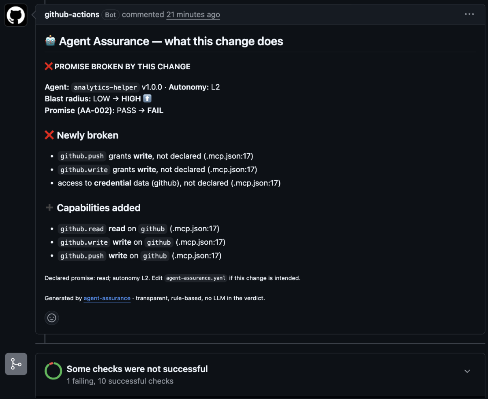

# Agent Assurance

**Declare what your agent may do. Verify it on every edit, every PR, every release.**

*In one line: your agent's permissions become a promise, and every change is checked against it — with a signed record of what it could do, when.*

Your repo *promises* what an AI agent is allowed to do (`agent-assurance.yaml`: read the CRM, no external send, a human approves actions). Agent Assurance *observes* what the configuration actually grants — MCP servers, Claude Code permissions — scores the blast radius, maps it to OWASP Agentic standards, and fails the change when the promise is broken, pointing at the file and line that broke it.

No dashboard, no backend, no LLM in the verdict, no network calls, nothing executed. A rule-based model you can read and reproduce by hand.


```bash
pipx install agent-assurance          # or: pip install agent-assurance
agent-assurance scan .                # observe the config; verify the promise if agent-assurance.yaml exists
```

---

## What it catches (real examples)

| Situation | What Agent Assurance says | Where |
|---|---|---|
| A PR adds `@modelcontextprotocol/server-github` to an agent declared read-only | **Promise broken:** `github.write` grants write, not declared (`.mcp.json:17`); blast radius LOW → HIGH | PR comment + red job ([live PR](https://github.com/kunko-ai-labs/agent-assurance/pull/16)) |
| `.claude/settings.json` gets `allow: Bash(*)` while the manifest says a human approves (L2) | **Promise broken:** `Bash(*)` runs without human approval, but declared autonomy is L2 | `examples/repos/claude-code-approval-broken` |
| A server nobody recognises appears in `.mcp.json` | `UNKNOWN` capability, scored as write; **promise not verifiable** (review, never a silent pass) | `examples/repos/mcp-unknown-server` |
| An MCP server config carries `GITHUB_PERSONAL_ACCESS_TOKEN` in `env` | Access to **credential** data, not declared (the value is never read, only the name) | same PR as above |
| Twenty `allow: Bash(git status:*)`-style rules | One read-only shell grant, *not* twenty unattended shells — no false alarm | [`docs/real-world.md`](docs/real-world.md) |
| A team adds `@stripe/mcp` | `stripe.refund` is **financial** and **irreversible** (+5); band jumps | catalogue entry with source |

Four public repositories scanned as-is, with what the tool saw and what it did not: [`docs/real-world.md`](docs/real-world.md).



## Why this exists

Agents are moving from chat into production: writing to CRMs, sending email, touching infrastructure, moving money. When an agent changes — a new MCP server, a broader permission, an `allow` that removes the human from the loop — nobody notices until something breaks.

Vulnerability scanners look for poisoned tools and leaked secrets. Permission-diff bots show what changed. Neither answers the governance question: **does this agent still do only what we said it does?** Agent Assurance answers it with deterministic checks that map to the **OWASP Top 10 for Agentic Applications (ASI01–ASI10)**, and leaves a per-commit record an auditor can reconstruct — the shape EU AI Act art. 12 asks for. See [`docs/landscape.md`](docs/landscape.md) for what else exists and why this sits where it sits.

## One promise, three enforcement points

| When | How | What the person sees |
|---|---|---|
| **While the agent edits** | Claude Code [PostToolUse hook](contrib/claude-code/) or the [MCP server](contrib/claude-code/) (`would_break`) | The agent is told, in the same turn, that its edit breaks the promise — before a commit exists |
| **In the pull request** | GitHub Action `mode: diff` | One comment: *"Promise broken by this change: `github.write` grants write, not declared (.mcp.json:17)"*; job goes red |
| **On every push / release** | Action `mode: scan` + SARIF + `attest` | The verdict in the Security tab and the job summary, anchored at file:line — and an **in-toto attestation** (signed with Sigstore when `attest: sign`) that records what the agent could do at that commit |

Same engine, same verdict, same words in all three.

### Evidence that survives the repo

```bash
agent-assurance attest . -o aa-attestation.json
```

Writes an [in-toto Statement v1](https://in-toto.io/Statement/v1): the manifest and every parsed config file as subjects (sha256), and as predicate the tool version, timestamp, git commit, the declared promise, the observed capabilities, the full report and the standards touched. Archive it with the release, or let the Action sign it:

```yaml
permissions:
  id-token: write
  attestations: write
steps:
  - uses: kunko-ai-labs/agent-assurance@v0.4
    with:
      mode: scan
      attest: sign          # 'write' = unsigned JSON artifact only
```

Then anyone can check, later, what your agent was allowed to do at a given commit and whether it matched the promise:

```bash
gh attestation verify .mcp.json -R your-org/your-repo \
  --predicate-type https://github.com/kunko-ai-labs/agent-assurance/attestation/v1
```

This is the record-keeping shape EU AI Act art. 12 (reconstructability) and SOC 2 change-management reviews ask for, for the *capabilities* of an agent; the mapping is `adapted`, not a conformance claim. Runtime logs remain the other half. Sigstore signing needs a public repository or GitHub Enterprise; the unsigned JSON works everywhere.

## Two inputs, one verdict

| | What it is | Where it comes from |
|---|---|---|
| **Declared** | The promise: capability classes, systems, data and autonomy the agent is *meant* to have | `agent-assurance.yaml`, written by the team |
| **Observed** | What the configuration *actually grants* — and whether a human is still in the loop | `scan`: MCP server configs for Claude Code, Cursor, Gemini CLI and VS Code (via a [curated, sourced catalogue](src/agent_assurance/scan/catalog.py)), and Claude Code `.claude/settings.json` permissions. Unknown servers and tools are `UNKNOWN`, never guessed |

| Check | Question | Verdict |
|---|---|---|
| **AA-001 Blast Radius** | If this agent misbehaves, how much can it break? | LOW/MEDIUM pass · HIGH review · CRITICAL fail · any `UNKNOWN` ≥ review |
| **AA-002 Declared vs Observed** | Does the configuration stay within the promise? | Undeclared write/delete/execute/external_send/financial, sensitive data, or an unscoped auto-approval under declared autonomy ≤ L2 → **fail** · extra reach, scoped auto-approval or `UNKNOWN` → review · within → pass |

`scan` without a manifest still works: you get the observed blast radius and a "Sources scanned" table. `check` on a manifest alone runs AA-001 only. `diff` compares two trees and tells you what *this change* did.

## What you get in a PR

```
❌ PROMISE BROKEN BY THIS CHANGE

Agent: analytics-helper v1.0.0 · Autonomy: L2
Blast radius: LOW → HIGH ⬆️
Promise (AA-002): PASS → FAIL

❌ Newly broken
- `github.write` grants write, not declared (.mcp.json:17)
- `github.push` grants write, not declared (.mcp.json:17)
- access to credential data (github), not declared (.mcp.json:17)

➕ Capabilities added
- `github.read` read on `github` (.mcp.json:17)
- `github.write` write on `github` (.mcp.json:17)

Declared promise: read; autonomy L2. Edit agent-assurance.yaml if this change is intended.
```

Live example: [the open demo PR](https://github.com/kunko-ai-labs/agent-assurance/pull/16) stays red on purpose.

## The manifest is the promise

Every check consumes the same representation, `agent-assurance/v1`. Written by hand it is a declaration; produced by `scan` it is an observation, with `source: path:line` on every tool.

```yaml
apiVersion: agent-assurance/v1
agent:
  name: support-agent
  version: 1.0.0
framework:
  name: langgraph
tools:
  - name: crm.read
    type: read
    system: crm
  - name: crm.write
    type: write
    system: crm
data:
  - type: pii
    systems: [crm]
autonomy: 2          # a human approves actions
delegation:
  enabled: false
```

Schema: [`schema/agent-assurance.schema.json`](schema/agent-assurance.schema.json). The manifest is framework-agnostic on purpose: it describes *what the agent may reach*, not how it is built.

## What the scanner understands

**MCP server configs** — `.mcp.json` (Claude Code), `.cursor/mcp.json`, `.gemini/settings.json`, `.vscode/mcp.json`. Each server becomes a system. Its access classes come from the catalogue entry for its package or name (e.g. `@modelcontextprotocol/server-github` → read, write). A remote `url` is network egress; an `env`/`headers` name that looks like a credential is credential access (the value is never read). The same server declared for several hosts counts once. A server not in the catalogue is `UNKNOWN`.

**Claude Code permissions** — `.claude/settings.json` and `settings.local.json`. Claude Code's built-in tools exist whether or not they are listed; a rule decides whether a **human approves** the call. So `allow` = runs without approval, `ask` = a person confirms, `deny` = removed. Precedence: deny > ask > allow. Rules collapse per capability class: ten `allow: Bash(...)` rules are one shell grant, not ten.

| Rule | Class | Notes |
|---|---|---|
| `Read`, `Glob`, `Grep`, `LS`, `WebFetch`, `WebSearch` | read | |
| `Edit`, `Write`, `MultiEdit`, `NotebookEdit` | write | +2 points if `allow` and unscoped |
| `Bash`, `Bash(*)` | execute, unscoped | +2 points if `allow`; breaks a promise of autonomy ≤ L2 |
| `Bash(git status:*)`, `Bash(grep:*)`, `Bash(ls:*)`… | read (scoped) | read-only commands are not "the agent runs shell unattended" |
| `Bash(npm test:*)`, any other scoped command | execute (scoped) | no auto-approval penalty; AA-002 says *review*, not *broken* |
| `Agent`, `Task` | execute (subagents) | |
| `mcp__<server>__<tool>`, `mcp__<server>` | the server's widest class from the catalogue | a single tool is scoped; a whole server is not |
| `defaultMode: acceptEdits` / `bypassPermissions` | write / execute, auto-approved | |
| anything else | unknown | scored as write, never as safe |

Every scan ends with a **Sources scanned** table: files parsed, files detected but not supported yet (`.codex/config.toml`, `AGENTS.md`), and what was deduced from each. A repo with nothing scannable and nothing declared exits 2 — never an empty PASS.

## The risk model is transparent

Not an "AI risk score". Every point is attributable:

| Property | Points |
|---|---|
| tool `read` / `execute`,`write`,`external_send` / `delete`,`financial` | 1 / 3 / 5 |
| data `pii` / `health`,`financial` / `credential` | 3 / 4 / 5 |
| production system | +5 |
| irreversible action | +5 |
| delegation enabled | +3 |
| autonomy above L2 | +2 per level |
| tool of unknown class (`UNKNOWN`) | 3 (scored as write, never as safe) |
| non-read, unscoped tool auto-approved by the host | +2 |

Bands: LOW `<8` · MEDIUM `<16` · HIGH `<28` · CRITICAL `>=28`. HIGH → review, CRITICAL → fail (configurable with `--fail-on`). Weights live in one file, [`risk.py`](src/agent_assurance/risk.py).

## Use it

### CLI

```bash
agent-assurance scan .                                   # observe + verify (picks up ./agent-assurance.yaml)
agent-assurance scan path/to/repo -m promise.yaml --format sarif -o aa.sarif
agent-assurance diff base-checkout head-checkout --fail-on-delta   # what did this change do?
agent-assurance attest . -o aa-attestation.json          # evidence: what the config granted at this commit
agent-assurance check all agent-assurance.yaml           # the promise alone: how much could it break?
agent-assurance validate agent-assurance.yaml            # schema-check
```

Formats: `md` (PR comment / job summary), `json` (pipelines), `sarif` (GitHub code scanning; PASS is `kind: pass` so a clean agent never creates an alert; `diff` adds `baselineState`).

**Exit codes are a contract:** `0` pass (REVIEW too, unless `--fail-on review`) · `1` gate tripped · `2` usage/manifest error. Tested in `tests/test_cli_contract.py` and exercised with the installed binary in CI.

Try the bundled repos under `examples/repos/`: `mcp-promise-kept` (PASS), `mcp-promise-broken` (FAIL), `mcp-unknown-server` (REVIEW), `claude-code-approval-kept` (PASS), `claude-code-approval-broken` (FAIL: `allow: Bash(*)` under a declared L2).

### GitHub Action

```yaml
permissions:
  contents: read
  pull-requests: write     # only for the diff comment
  security-events: write   # only if upload-sarif: true

steps:
  - uses: actions/checkout@v4
  - uses: kunko-ai-labs/agent-assurance@v0.4
    with:
      mode: diff             # on pull_request: what did this change do? (comment + gate)
      # mode: scan           # on push: observe + verify, SARIF to the Security tab
      manifest: agent-assurance.yaml
      fail-on: fail          # or: review
      fail-on-delta: "true"  # diff: also fail when reach grows or the promise breaks
      sarif: aa.sarif        # optional
      upload-sarif: "true"   # optional
```

The markdown report lands in the job summary; in `diff` mode one PR comment is created and then updated on every push. This repo's own [`assurance.yml`](.github/workflows/assurance.yml) asserts that the Action passes what it should and blocks what it should — a green run means the gate still works.

### pre-commit

```yaml
- repo: https://github.com/kunko-ai-labs/agent-assurance
  rev: v0.3.0
  hooks:
    - id: agent-assurance-scan
```

### Inside the agent's own session

```bash
pip install "agent-assurance[mcp]"
claude mcp add agent-assurance -- agent-assurance-mcp
```

Tools `scan`, `check` and `would_break`: the agent can ask *"if I add this MCP server, does the promise break?"* before touching a file. Or install the [PostToolUse hook](contrib/claude-code/) and the agent is told the moment an edit breaks the promise. Details in [`contrib/claude-code/`](contrib/claude-code/).

### As a library

```python
from agent_assurance import engine
from agent_assurance.checks.base import Context
from agent_assurance.manifest import Manifest
from agent_assurance.scan import scan_directory

declared = Manifest.from_file("agent-assurance.yaml")
result = scan_directory(".", declared)
report = engine.run(result.observed, ctx=Context(declared=declared, observed=result.observed), sources=result.sources)
print(report.verdict, [(r.check_id, r.status.value) for r in report.results])
```

Add a source: subclass `scan.base.Scanner` (`detect()` + `parse()` returning tools with `source="path:line"`), register it in `scan.SCANNERS`, add a fixture under `examples/repos/` and a job in `assurance.yml`. Add a server: one `CatalogEntry` with its source. Add a check: subclass `checks.base.Check`, register in `checks.ALL_CHECKS`.

## Design rules (what you can rely on)

- **Deterministic.** No LLM anywhere in the verdict. Same input, same output, reproducible by hand.
- **Nothing executed, nothing sent.** Config files are read; MCP servers are never started; secret values are never read, only variable names; no network.
- **Unknown is a result, not a silence.** Unrecognised servers and tools are `UNKNOWN`, score conservatively, and block a "promise kept".
- **Honest standards mapping.** OWASP ASI controls are `maps`; a control borrowed from OWASP APTS (autonomous pentest platforms) or from EU AI Act art. 12 is `adapted`. No conformance is claimed that does not exist.
- **Contracts are tested.** Exit codes, SARIF shape, Action YAML and every fixture's verdict run in CI on Python 3.10–3.12.

## Roadmap

| Version | What | Why |
|---|---|---|
| v0.2 (done) | `scan` for MCP configs + Claude Code permissions; AA-002 declared vs observed | The manifest becomes an attestation |
| v0.3 (done) | `diff` base vs head; Action `mode: diff` with PR comment; MCP server + hook; Cursor/Gemini/VS Code configs | The promise is enforced where the change happens |
| v0.4 (done) | **Attestation** per commit/release: in-toto statement, Sigstore-signed via `actions/attest` | Evidence that survives the repo — what AI Act art. 12 and SOC 2 reviewers actually ask for |
| next | **Capability card**: a single-file HTML "nutrition label" per agent, from the same JSON, shareable with auditors and customers | People outside the repo need to read the verdict too |
| next | **Policy file** (`agent-assurance.policy.yaml`): tune weights, bands and which classes break a promise, per org | Seniors want the model, not our defaults |
| next | More observed sources: Codex `config.toml`, OpenAI Agents / LangChain / CrewAI serialized tool definitions | Business agents, not only coding agents |

Runtime governance (intercepting calls, approvals, ledgers) is a different product and stays out of scope here: this tool checks what the repo says the agent can do, and holds it to its word.

## License

Apache-2.0 © 2026 Kunko AI Labs
